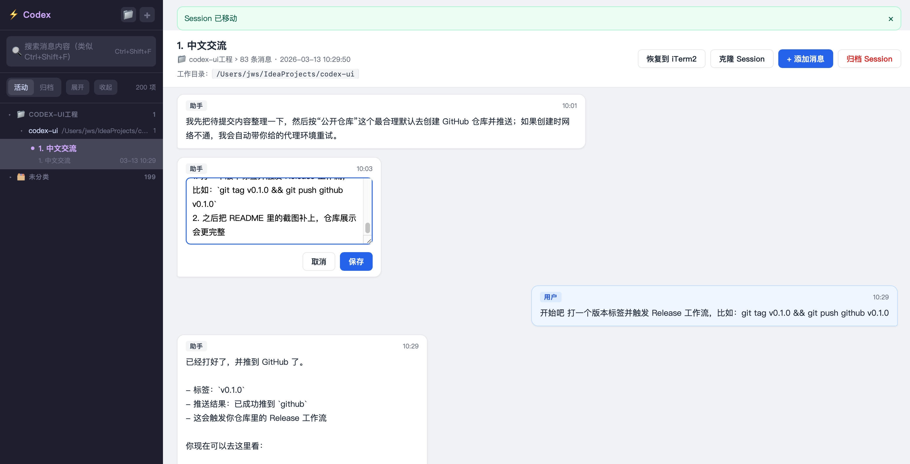
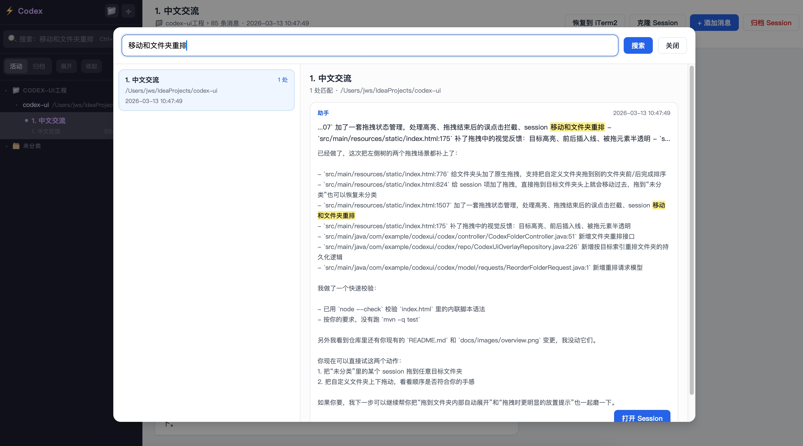

# codex-ui

给 Codex 本地 session 做可视化管理的一个轻量 UI。

它会直接读取本机 `~/.codex` 里的 session、索引库和历史记录，并通过一个简单的 Spring Boot 服务把这些数据展示成网页，方便做查看、整理、恢复、克隆、分支和消息级编辑。

目前它更偏向个人本地工具，而不是通用 SaaS。

## 截图

你可以在这里放项目截图：

```text
docs/images/overview.png
docs/images/search.png
```

示例：

```md


```

如果你暂时还没准备截图，也完全没关系，先发项目也没问题，后面再补就行。

## 现在已经支持

- Session 列表浏览
- 三级目录树
  - 第一级：自定义目录 / 未分类
  - 第二级：工作目录 `cwd`
  - 第三级：session
- 自定义目录排序（上移 / 下移）
- 一键展开 / 一键收起左侧目录树
- Session 归档 / 取消归档
- Session 重命名
- Session 移动到目录
- 在 iTerm2 中恢复 session
- 克隆 session
- 从某条消息开始创建分支 session
- 查看聊天消息
- 编辑 / 删除某条消息
- 按消息内容做全文搜索
  - 类似 IDEA 的全局搜索弹窗
  - 展示匹配项和匹配详情
  - 可直接跳转到对应 session 和对应消息

## 数据来源

### 读取的 Codex 原始数据

- `~/.codex/sessions/YYYY/MM/DD/rollout-*.jsonl`
- `~/.codex/state_*.sqlite`
- `~/.codex/history.jsonl`

### codex-ui 自己的 overlay 数据

- `~/.codex-ui/codex-ui.sqlite`

overlay 主要保存：

- 自定义目录
- session 目录归属
- session 归档状态
- 自定义目录排序

## 哪些操作会改动 Codex 原始数据

会直接改 `~/.codex`：

- 编辑消息
- 删除消息
- 克隆 session
- 从消息处分支 session

主要只改 overlay，不直接改 Codex 原始 rollout：

- Session 重命名
- Session 归档 / 取消归档
- Session 移动到目录
- 自定义目录管理和排序

## 运行环境

- Java 8+
- Maven
- macOS（如果你要使用“恢复到 iTerm2”）
- iTerm2

## 本地运行

```bash
mvn spring-boot:run
```

启动后打开：

```text
http://localhost:8080
```

## 打包

本地打包：

```bash
mvn -DskipTests package
```

打包完成后可直接运行：

```bash
java -jar target/codex-ui-0.0.1-SNAPSHOT.jar
```

## 配置

默认配置在 `src/main/resources/application.properties`：

```properties
server.port=8080
codex.storage.home=${user.home}/.codex
codex.storage.list-limit=50
codexui.home=${user.home}/.codex-ui
codexui.db=${codexui.home}/codex-ui.sqlite
```

你可以通过环境变量或启动参数覆盖这些配置。

## GitHub Actions

仓库已经带了两个工作流：

- `.github/workflows/build.yml`
  - 在 `push` / `pull_request` 时自动构建
  - 自动上传 JAR 构建产物到 Actions Artifacts
- `.github/workflows/release.yml`
  - 当你推送 `v*` tag 时自动打包
  - 自动创建 GitHub Release
  - 自动把 JAR 上传到 Release 附件里

### 发布一个可下载版本

例如：

```bash
git tag v0.1.0
git push origin v0.1.0
```

随后 GitHub Actions 会自动：

- 构建项目
- 生成 release
- 上传 `codex-ui.jar`

别人就可以直接去 GitHub Releases 下载。

## 恢复 session 到 iTerm2

当你在页面里点击“恢复到 iTerm2”时，后端会调用 AppleScript：

- 新开一个 iTerm2 窗口
- 进入该 session 当时的工作目录
- 自动执行：

```bash
codex resume <sessionId>
```

这部分目前是 macOS + iTerm2 专用。

## 搜索

页面支持按消息内容做全文搜索：

- 点击左上搜索框
- 或按 `Ctrl+Shift+F`

搜索结果会展示：

- 命中的 session
- 命中次数
- 命中片段
- 命中消息详情

点击结果可直接跳转到对应 session，并滚动定位到那条消息。

## 适合谁

这个项目更适合：

- 经常使用 Codex CLI
- 本地积累了很多 session
- 想按目录 / 工作路径整理 session
- 想从历史对话中恢复、克隆、分支继续聊
- 想快速搜索某条历史消息出现在哪个 session

## 注意事项

- 这是一个非官方 Codex UI。
- 部分操作会直接修改 `~/.codex` 下的真实数据。
- 在重要数据上使用前，建议先自行备份 `~/.codex`。
- “恢复到 iTerm2” 依赖本机已安装并可正常调用 `codex` 命令。
- GitHub Release 默认产物是 JAR，适合已安装 Java 的用户直接运行。

## 项目结构

```text
src/main/java/com/example/codexui/
├── app/        # 应用配置
├── codex/      # controller / service / model / repo
└── common/     # 通用异常处理

src/main/resources/
├── application.properties
└── static/
    └── index.html
```

## 后续方向

- 更稳的消息搜索索引
- 更细的 session 元信息展示
- 更多恢复 / 分支工作流
- 更完善的目录管理体验

## License

暂未添加。若你准备公开到 GitHub，建议补一个明确的开源协议，例如 MIT。
